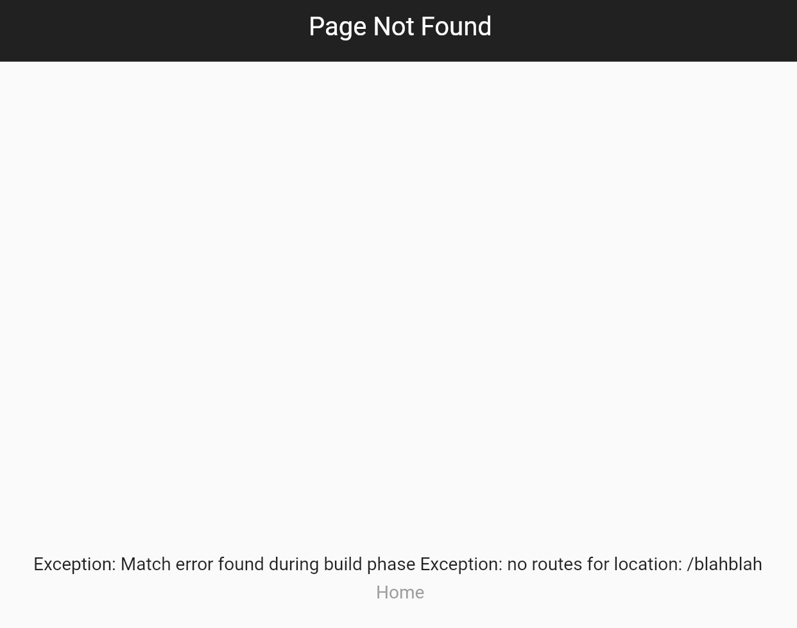

# Flutter eCommerce App

## Learning points:

### GoRouter 5.1.1
Install GoRouter and and configure it inside `MaterialApp.router` using the `routeConfig` property.

``` Dart
return MaterialApp.router(
  routerConfig: goRouter,
  ...
)

// importing goRouter which declares all routes in a separate file
```

Set `initiaLocation` and `debugLogDiagnostics` if needed.

```dart
final goRouter = GoRouter(
  initialLocation: '/',
  // produces an output for all navigation events in the console
  debugLogDiagnostics: true,
  routes: [...],
```

<u>Changing the URL path strategy</u>
```dart
// ignore: depend_on_referenced_packages
import 'package:flutter_web_plugins/url_strategy.dart';

void main() {
  // turn off the # in the URLs on the web
  usePathUrlStrategy();
  ...
}
```
<br>

<u>Using a custom page builder</u>

Using the default material page transition:
```dart
GoRoute(
  path: 'cart',
  builder: (context, state) => const ShoppingCartScreen(),
)
```
Using a custom page transition:
```dart
GoRoute(
  path: 'cart',
  pageBuilder: (context, state) => MaterialPage(
    key: state.pageKey,
    fullscreenDialog: true,
    child: const ShoppingCartScreen(),
  ),
)

// Return a MaterialPage.

// state.pageKey: is based on the current path for that page in the stack of pages, so it will uniquely identify the page without having to hardcode a key or come up with one yourself

/* fullScreenDialog ->
page will slide from the bottom and affect the close/back icon on the appbar.
*/
```
More about [transition](https://docs.page/csells/go_router/transitions)

<br>

<u>Adding parameters</u>
```dart
GoRoute(
  path: 'product/:id',
  name: AppRoute.product.name, //enum
  builder: (context, state) {
    final productId = state.params['id']!;
    return ProductScreen(productId: productId);
  },
)
```

Inside your widget, pass the params as map literals.
```dart
context.goNamed(
  AppRoute.product.name,
  params: {'id': product.id},
)
```

<br>

<u>Error handling</u>

GoRouter will show a default error screen in the following cases:

- Route cannot be found for a giver URI
- More than one route matches a location
- Any GoRouter builder throws an exception



<br>

You can define your own custom `errorBuilder` as well:
```dart
final goRouter = GoRouter(
  routes: [ ... ],
  errorBuilder: (context, state) => const NotFoundScreen(),
);
```
Exception:

Routes with parameters
```dart
GoRoute(
  path: 'product/:id',
  name: AppRoute.product.name,
  builder: (context, state) {
    final productId = state.params['id']!;
    return ProductScreen(productId: productId);
  },
)

// passing a parameter to a product that does not exist:
context.goNamed(
  AppRoute.product.name,
  params: {'id': 'non-existent-id'},
)

/* GoRouter will find a matching product/:id route and will NOT call the errorBuilder.
This means that you will need to handle a "product not found" page for the ProductScreen.
```

<hr>


### Riverpod
How to create providers:

- Declare as a global variable
- Specify a type annotation
- Implement the body

``` Dart
final productRepositoryProvider = Provider<FakeProductsRepository>((ref) {
  return FakeProductsRepository;
})
```

Autodispose
- Try to use autodispose when using `streamProvider` and `futureProvider`
- This will close the coneection to the stream when it is no longer needed


### [LICENSE: MIT](../LICENSE.md)
